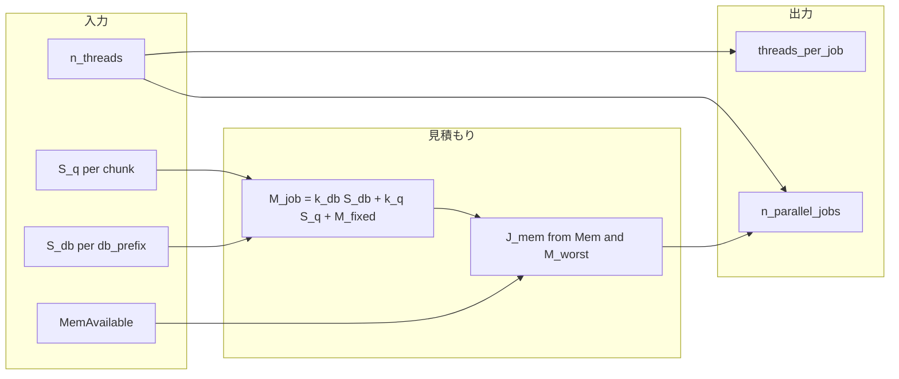

# BLASTN チャンク区切りと並列スケジューリング

本書は [`R/dev/02_functions_rbh.R`](02_functions_rbh.R) に実装した、reciprocal BLAST（`blastn`）実行時の **チャンク分割** と **`threads_per_job` / `n_parallel_jobs`** の決定方針をまとめたものである。

## 背景

- NCBI BLAST+ は核苷酸 DB を **mmap** で扱う。常駐メモリ（RSS）はディスク上のインデックス・シーケンスより小さいことも多いが、**同時に複数 `blastn` を走らせる**とページキャッシュの競合や、クエリ側の読み込み・バッファで RAM 圧力が上がる。
- 旧実装は `MemAvailable` と固定ヒューリスティック（ゲノム数 × 一定バイト）だけでチャンク数を決め、**並列ジョブ数は CPU のみ**から算出していた。
- 本設計では **DB ディスクサイズ** と **クエリ（CDS ファイル）サイズ** からジョブあたりのメモリを見積もり、`MemAvailable` と `n_threads` の両方から **並列数の上限** と **ジョブあたりスレッド数** を決める。

## 記号と入力

| 記号 | 意味 |
|------|------|
| `MemAvailable` | Linux の `/proc/meminfo` の `MemAvailable` 等（[`.mem_available_bytes()`](../R/01_utilities.R)） |
| `n_threads` | ユーザーが渡す BLAST 用スレッド上限（論理コア想定） |
| `db_prefix` | BLAST DB のパス接頭辞（例: `.../1_all_cds.blastdb`、拡張子なし） |
| `S_db` | その `db_prefix` に紐づく **ディスク上の全 DB ファイル** のサイズ合計 |
| `S_q(c)` | チャンク `c` に含まれるゲノムの CDS ファイルサイズの合計 |
| `M_db`, `M_q`, `M_fixed` | 下式の見積もり成分 |

## メモリ見積もり

### DB 側

1. `db_fn` は `to_be_blast$db` の値（`.blastdb.ndb` を除いたパス＝`db_prefix` と同一視可能）。
2. `dirname(db_prefix)` 内で、`basename(db_prefix).*` にマッチするファイル（`.ndb`, `.nhr`, `.nin`, `.nsq`, `.not`, `.ntf`, `.nto` 等）の **`file.size` の和** を `S_db` とする（関数 `.blastdb_disk_bytes`）。
3. **見積式**: `M_db = k_db * S_db`。既定 `k_db = 1.0`。mmap では RSS は `S_db` 未満になりうるが、**同時実行の安全側**としてディスクサイズベースにする。

### クエリ側

1. ゲノム名から `input_list$cds` の対応ファイルを引き、`file.size` を合計して `S_q(c)` とする。
2. **見積式**: `M_q(c) = k_q * S_q(c)`。既定 `k_q = 1.75`（1.5〜2.0 の中間）。

### ジョブ合計

- `M_job(c) = M_db(db) + M_q(c) + M_fixed`
- `M_fixed`: blastn プロセス・バッファ用の定数（既定 384 MiB）。

### 並列ジョブ数の RAM 上限

- 全チャンクについて `M_worst = max_c M_job(c)` を取る。
- `margin = max(512 MiB, 0.05 * MemAvailable)`。
- `J_mem = floor((MemAvailable - margin) / M_worst)`（`M_worst == 0` のときは実質制限なしとして大きな値を用いる）。

**ページキャッシュ共有**: 同一 `db_prefix` のジョブはカーネルがページを共有しうる。初回実装では共有を仮定せず `J_mem` を上式のままとする（将来、同一 DB の重みを下げるオプションを追加可能）。

## チャンク区切り

DB ごとにゲノム行をグループ化し、**1 チャンクあたりのクエリ見積もり `M_q` が `MemAvailable` の一定割合を超えない**ように **貪欲に** 複数チャンクに分割する。

- 目安: `M_q_max = frac_ma * MemAvailable`（既定 `frac_ma = 0.25`）。
- 対応する生データ上限: `S_q_max = M_q_max / k_q`。
- ゲノムを順に足し、累積 `S_q` が `S_q_max` を超えるタイミングで新チャンクを開始する。単一ゲノムだけで `S_q_max` を超える場合は **1 チャンクにそのゲノムのみ**（巨大クエリは警告の対象になりうる）。

チャンク割り当て後、各チャンクで `M_job(c)` を再計算し `M_worst` と `J_mem` を求める。

## CPU 側: `threads_per_job` と `n_parallel_jobs`

出力は `mclapply(..., mc.cores = n_parallel_jobs)` と `blastn -num_threads` にそのまま渡す。

1. `n_chunk` = 確定後のチャンク総数（既存どおり `chunk` と `db` の組で因子化した ID 数）。
2. `J_cap = min(J_mem, n_chunk)`（少なくとも 1）。
3. `n_threads < min_threads` のときは従来どおり `threads_per_job = n_threads`, `n_parallel_jobs = 1`。
4. それ以外:
   - `threads_per_job = max(min_threads, min(max_threads_blastn, floor(n_threads / J_cap)))`
   - `n_parallel_jobs = min(J_cap, max(1, floor(n_threads / threads_per_job)))`
   - `max_threads_blastn` 既定 16（I/O 過多を抑える上限）。
5. **整合**: `n_parallel_jobs * threads_per_job > n_threads` の間、`threads_per_job` か `n_parallel_jobs` を減らして収束させる。

### `J_mem < 1` のとき

- 警告を出し、`n_parallel_jobs = 1`、`threads_per_job = min(n_threads, max_threads_blastn)` とする。

## 設定の上書き

`.jobAssign` の引数（または将来 `options()`）で次を変更可能にした:

| 引数 | 既定 | 意味 |
|------|------|------|
| `k_db` | 1.0 | DB ディスクサイズに対する係数 |
| `k_q` | 1.75 | クエリファイルサイズに対する係数 |
| `M_fixed_bytes` | 384 MiB | ジョブ固定オーバーヘッド |
| `frac_ma` | 0.25 | チャンクあたりクエリ `M_q` の `MemAvailable` に対する上限割合 |
| `max_threads_blastn` | 16 | 1 ジョブあたりの `blastn` スレッド上限 |

## 実装チェックリスト

- [x] `.blastdb_disk_bytes(db_prefix)` で `S_db` を計測
- [x] `input_list` からゲノムごとの CDS `file.size` を取得
- [x] DB ごとの貪欲チャンク分割と、グローバル `chunk` ID の付与（既存の `factor` ロジックと整合）
- [x] `M_worst`, `J_mem`, `J_cap` に基づく `threads_per_job` / `n_parallel_jobs`
- [x] `J_mem < 1` とオーバーサブスクライブの処理
- [x] 決定値の `message` ログ（任意だが実装済み）

## 参考: データフロー

